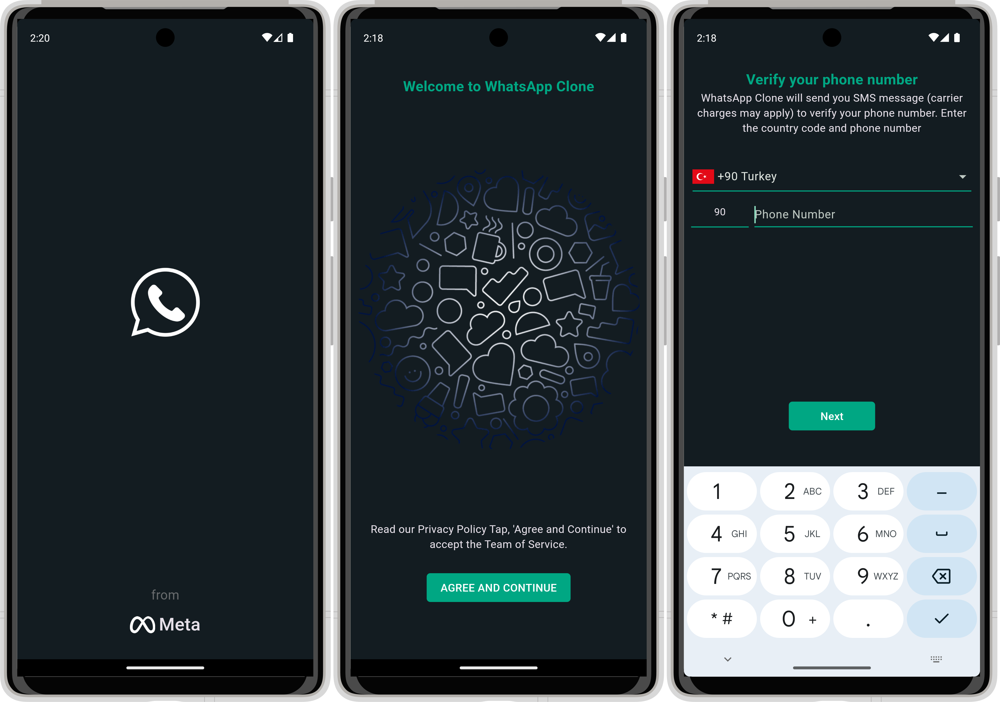
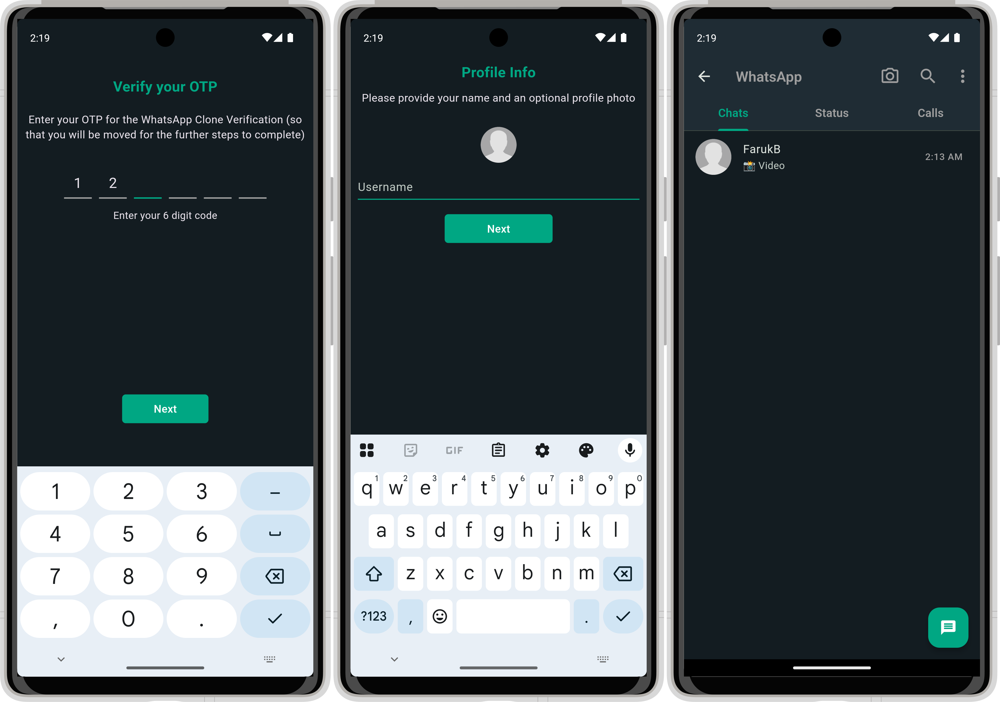
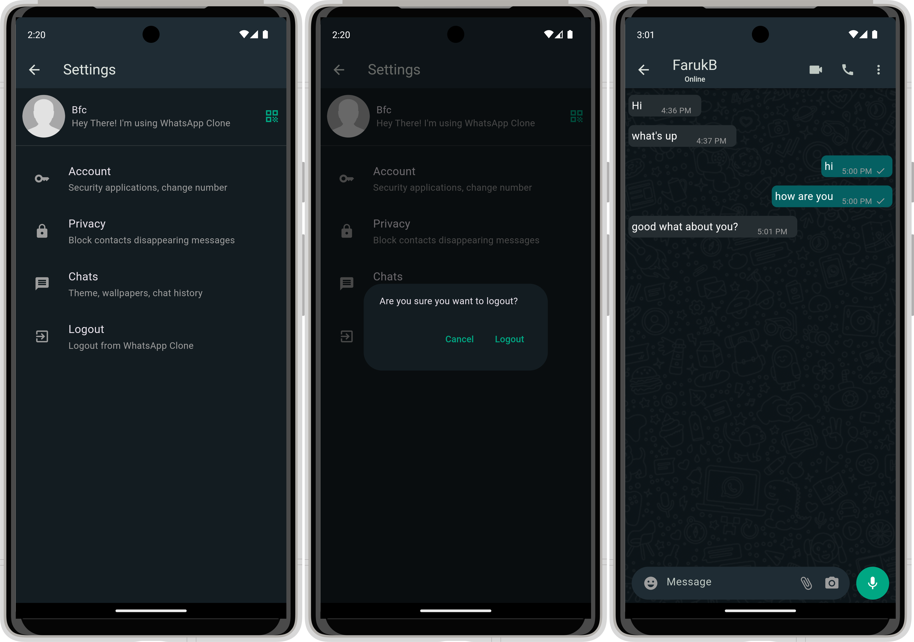

# Flutter WhatsApp Clone Clean Architecture

## App Features
This App includes the following features.

- Authentication (Phone Auth Firebase)
- Update Profile
- Realtime Chat (Text, Emoji, Image, Voice, Gif, Video)
- Reply to any Chat (Text, Image, Voice, Gif, Video)
- Video Call (Agora SDK)
- Delete Messages
- Status & Expire status after 24 hours
- Seen Status
- Delete Status
- Call History
- Sign Out

## App Screens

# Built With

- [Flutter&Dart](https://docs.flutter.dev/get-started/codelab)
- [Basic Widgets](https://docs.flutter.dev/ui/widgets/basics)
- [Material Component Widgets](https://docs.flutter.dev/ui/widgets/material)
- [Async Widgets](https://docs.flutter.dev/ui/widgets/async)
- [Firebase](https://firebase.google.com)
- [Firebase Core](https://pub.dev/packages/firebase_core)
- [Firebase Auth](https://pub.dev/packages/firebase_auth)
- [Cloud Firestore](https://pub.dev/packages/cloud_firestore)
- [Firebase Storage](https://pub.dev/packages/firebase_storage)
- [Uuid](https://pub.dev/packages/uuid)
- [Flutter Toast](https://pub.dev/packages/fluttertoast)
- [Flutter Contacts](https://pub.dev/packages/flutter_contacts)
- [Image Picker](https://pub.dev/packages/image_picker)
- [File Picker](https://pub.dev/packages/file_picker)
- [Video Player](https://pub.dev/packages/video_player)
- [Country Pickers](https://pub.dev/packages/country_pickers)
- [Flutter Pin Code Fields](https://pub.dev/packages/flutter_pin_code_fields)
- [Cached Network Image](https://pub.dev/packages/cached_network_image)
- [Flutter Bloc](https://pub.dev/packages/flutter_bloc)
- [Equatable](https://pub.dev/packages/equatable)
- [Get It](https://pub.dev/packages/get_it)
- [Font Awesome Flutter](https://pub.dev/packages/font_awesome_flutter)
- [Agora UIkit](https://pub.dev/packages/agora_uikit)
- [Swipe To](https://pub.dev/packages/swipe_to)
- [Emoji Picker Flutter](https://pub.dev/packages/emoji_picker_flutter)
- [Intl](https://pub.dev/packages/intl)
- [Get Time Ago](https://pub.dev/packages/get_time_ago)
- [Giphy Picker](https://pub.dev/packages/giphy_picker)
- [Path Provider](https://pub.dev/packages/path_provider)
- [Audio Players](https://pub.dev/packages/audioplayers)
- [Just Audio](https://pub.dev/packages/just_audio)
- [Flutter Sound](https://pub.dev/packages/flutter_sound)
- [Flutter Story View](https://pub.dev/packages/flutter_story_view)